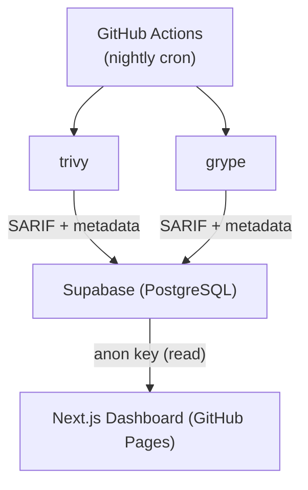

# Container Image Scans

Compare CVE findings across container images using
[trivy](https://trivy.dev/) and [grype](https://github.com/anchore/grype)
scanners. Results are stored in [Supabase](https://supabase.com/) and
visualised in a Next.js dashboard deployed to GitHub Pages.

## Table of Contents

- [Architecture](#architecture)
- [Container Images](#container-images)
- [Prerequisites](#prerequisites)
- [Supabase Setup](#supabase-setup)
- [GitHub Secrets](#github-secrets)
- [Local Development](#local-development)
- [GitHub Actions](#github-actions)
- [Project Structure](#project-structure)

## Architecture



## Container Images

Images are organised into groups:

| Group  | Image                                                        |
|--------|--------------------------------------------------------------|
| python | `docker.io/python:alpine`                                    |
| python | `gcr.io/distroless/python3-debian12:latest`                  |
| python | `cgr.dev/chainguard/python:latest`                           |
| python | `registry.access.redhat.com/ubi10/python-312-minimal:latest` |
| node   | `docker.io/node:24-alpine`                                   |
| node   | `gcr.io/distroless/nodejs24-debian12:latest`                 |
| node   | `cgr.dev/chainguard/node:latest`                             |
| node   | `registry.access.redhat.com/ubi10/nodejs-24-minimal:latest`  |
| php    | `docker.io/php:alpine`                                       |
| php    | `cgr.dev/chainguard/php:latest`                              |
| php    | `registry.access.redhat.com/ubi10/php-83:latest`             |
| nginx  | `docker.io/nginx:alpine`                                     |
| nginx  | `cgr.dev/chainguard/nginx:latest`                            |
| nginx  | `registry.access.redhat.com/ubi10/nginx-126:latest`          |
| ruby   | `docker.io/ruby:alpine`                                      |
| ruby   | `cgr.dev/chainguard/ruby:latest`                             |
| ruby   | `registry.access.redhat.com/ubi10/ruby-33:latest`            |
| base   | `docker.io/alpine:latest`                                    |
| base   | `docker.io/debian:stable-slim`                               |
| base   | `docker.io/ubuntu:latest`                                    |
| base   | `gcr.io/distroless/static:latest`                            |
| base   | `registry.access.redhat.com/ubi10-micro:latest`              |

To add more images, insert rows into the `container_images` table
with the appropriate `group_id`. The nightly scan picks up all images
automatically.

## Prerequisites

- [mise](https://mise.jdx.dev/)
  (`curl https://mise.run | sh`)
  -- manages Node.js, Supabase CLI, fnox, grype, trivy, and yq
  via `.mise.toml`
- A [Supabase](https://supabase.com/) project (free tier works)
- [Docker](https://www.docker.com/) (for running scans locally)

After cloning the repository, run `mise install` to install all
required tools at the versions defined in `.mise.toml`.

For local development the
[fnox](https://github.com/jdx/mise-env-fnox) mise plugin fetches
secrets from AWS Parameter Store (configured in `fnox.toml`). This
requires an AWS profile named `my-aws` with access to the
`/github/ruzickap/container-image-scans/actions-secrets/` path in
the `eu-central-1` region.

## Supabase Setup

### 1. Create a Supabase project

Sign up at [supabase.com](https://supabase.com/) and create a new
project. Note the **Project URL** and **API keys** from
`Settings > API`.

### 2. Apply the database migration

Run the `db:push` mise task, which links the CLI to your project and
pushes all pending migrations in `supabase/migrations/`:

```bash
export SUPABASE_ACCESS_TOKEN="your-access-token"
export SUPABASE_PROJECT_REF="your-project-ref"
export SUPABASE_DB_PASSWORD="your-db-password"
mise run db:push
```

When the fnox-env plugin is configured the three variables above are
populated automatically from AWS Parameter Store.

Alternatively, apply the schema manually via the **SQL Editor** in
the Supabase Dashboard:

1. Open your project in the Supabase Dashboard
2. Go to **SQL Editor**
3. Paste the contents of
   `supabase/migrations/20250301000000_initial_schema.sql`
4. Click **Run**

### 3. Verify tables exist

In the Supabase Dashboard go to **Table Editor** and confirm these
tables were created:

- `image_groups` (seeded with `python`, `node`, `php`, `nginx`,
  `ruby`, and `base`)
- `container_images` (seeded with all twenty-two images)
- `scans` (empty, populated by nightly scans)
- `cves` (empty, populated by nightly scans)

### 4. Adding new images

```sql
-- First add the group if it does not exist
INSERT INTO image_groups (name)
VALUES ('your-group')
ON CONFLICT (name) DO NOTHING;

-- Then add the image
INSERT INTO container_images (image, group_id)
VALUES (
  'docker.io/your-image:tag',
  (SELECT id FROM image_groups WHERE name = 'your-group')
);
```

## GitHub Secrets

Configure these secrets in `Settings > Secrets and variables >
Actions`:

| Secret                           | Description                                  |
|----------------------------------|----------------------------------------------|
| `SUPABASE_URL`                   | Supabase project URL (`https://…supabase.co`)|
| `SUPABASE_SERVICE_ROLE_KEY`      | Supabase **service_role** key (write access)  |
| `SUPABASE_ACCESS_TOKEN`          | Supabase personal access token (CLI auth)     |
| `SUPABASE_PROJECT_REF`           | Supabase project reference ID                 |
| `SUPABASE_DB_PASSWORD`           | Database password (used by `supabase db push`)|
| `NEXT_PUBLIC_SUPABASE_URL`       | Same as `SUPABASE_URL` (used at build time)   |
| `NEXT_PUBLIC_SUPABASE_ANON_KEY`  | Supabase **anon** key (read-only, public)     |
| `MY_RENOVATE_GITHUB_APP_ID`      | GitHub App ID for Renovate                    |
| `MY_RENOVATE_GITHUB_PRIVATE_KEY` | GitHub App private key for Renovate           |
| `MY_SLACK_BOT_TOKEN`             | Slack bot token for PR notifications          |
| `MY_SLACK_CHANNEL_ID`            | Slack channel ID for PR notifications         |

The `service_role` key is used by the scan script to write data.
The `anon` key is embedded in the static web app for read-only access
(safe because RLS policies restrict it to SELECT only).

## Local Development

### Web application

```bash
mise install   # install Node.js, Supabase CLI, fnox, etc.
mise run web:dev
```

Or manually:

```bash
cd web || exit
cp .env.example .env.local
# Edit .env.local with your Supabase credentials
npm install
npm run dev
```

Open [http://localhost:3000](http://localhost:3000).

### Running a scan locally

Scan all images and print a CVE summary (no Supabase needed):

```bash
mise run scan
```

To also upload results to Supabase, use the `scan:upload` task:

```bash
export SUPABASE_URL="https://xxx.supabase.co"
export SUPABASE_SERVICE_ROLE_KEY="your-service-role-key"
mise run scan:upload
```

### Pushing database migrations

```bash
mise run db:push
```

This requires `SUPABASE_ACCESS_TOKEN`, `SUPABASE_PROJECT_REF`, and
`SUPABASE_DB_PASSWORD` in the environment (or provided automatically
by the fnox-env plugin from AWS Parameter Store).

### Available mise tasks

| Task          | Description                                    |
|---------------|------------------------------------------------|
| `web:install` | Install web app dependencies                   |
| `web:dev`     | Start Next.js development server               |
| `web:build`   | Build static site export to `web/out/`         |
| `scan`        | Scan all container images, print CVE summary   |
| `scan:upload` | Scan all images and upload results to Supabase |
| `db:push`     | Link Supabase project and push migrations      |
| `build`       | Build the web app (alias for `web:build`)      |

The image list is defined in `images.yml` at the repository root.

## GitHub Actions

### Core workflows

#### Nightly Scans (`.github/workflows/nightly-scans.yml`)

- **Schedule**: every day at 00:00 UTC
- **Runner**: `ubuntu-24.04-arm`
- Installs trivy and grype via mise
- Pulls each container image, scans with both scanners
- Uploads SARIF output and extracted CVEs to Supabase
- Each scan record stores: image digest, scanner version,
  grype DB status, CVE count, full SARIF, and timestamp

#### Deploy Web (`.github/workflows/deploy-web.yml`)

- **Trigger**: push to `main` touching `web/**`, or manual
- Builds the Next.js static site
- Deploys to GitHub Pages

#### Apply Schema (`.github/workflows/apply-schema.yml`)

- **Trigger**: push to `main` touching `supabase/migrations/**`,
  or manual
- Links the Supabase project and pushes pending migrations via
  `mise run db:push`

### CI / quality workflows

| Workflow          | File                        | Trigger                          |
|-------------------|-----------------------------|----------------------------------|
| MegaLinter        | `mega-linter.yml`           | Push to non-main branches        |
| CodeQL            | `codeql.yml`                | Push to `main`, PRs, weekly      |
| OSSF Scorecards   | `scorecards.yml`            | Push to `main`, weekly           |
| Commit Check      | `commit-check.yml`          | PRs to `main`                    |
| Semantic PR Title | `semantic-pull-request.yml` | PRs (opened, edited, sync)       |

### Automation workflows

| Workflow              | File                        | Trigger                         |
|-----------------------|-----------------------------|---------------------------------|
| Release Please        | `release-please.yml`        | Push to `main`                  |
| Renovate              | `renovate.yml`              | Push to `main`, weekly          |
| Stale Issues/PRs      | `stale.yml`                 | Daily at 09:09 UTC              |
| PR Size Labeler       | `pr-size-labeler.yml`       | Pull requests                   |
| PR Slack Notification | `pr-slack-notification.yml` | PR events (open, review, close) |

## Project Structure

```text
container-image-scans/
+-- .github/
|   +-- workflows/
|       +-- apply-schema.yml          # Push DB migrations via Supabase CLI
|       +-- codeql.yml                # CodeQL security analysis
|       +-- commit-check.yml          # Commit message validation
|       +-- deploy-web.yml            # Deploy dashboard to GH Pages
|       +-- mega-linter.yml           # Comprehensive linting + security
|       +-- nightly-scans.yml         # Nightly trivy + grype scans
|       +-- pr-size-labeler.yml       # Auto-label PRs by size
|       +-- pr-slack-notification.yml # Slack notifications for PRs
|       +-- release-please.yml        # Automated releases
|       +-- renovate.yml              # Dependency updates
|       +-- scorecards.yml            # OSSF Scorecard analysis
|       +-- semantic-pull-request.yml # PR title validation
|       +-- stale.yml                 # Close stale issues/PRs
+-- scripts/
|   +-- apply-schema.sh              # Link Supabase + push migrations
|   +-- scan-and-upload.sh           # Scan images & upload to Supabase
+-- supabase/
|   +-- migrations/
|   |   +-- 20250301000000_initial_schema.sql  # Tables, RLS, seed data
|   +-- config.toml                  # Supabase CLI configuration
|   +-- schema.sql                   # Reference schema (seed + DDL)
+-- web/                             # Next.js 15 dashboard application
|   +-- src/
|   |   +-- app/
|   |   |   +-- globals.css          # Global styles + CSS variables
|   |   |   +-- layout.tsx           # Root layout
|   |   |   +-- page.tsx             # Main page
|   |   +-- components/
|   |   |   +-- CveDetailTab.tsx     # CVE detail table with filters
|   |   |   +-- CveTooltip.tsx       # Hover tooltip with markdown
|   |   |   +-- HistoryCharts.tsx    # History line charts
|   |   +-- lib/
|   |       +-- supabase.ts          # Supabase client + data fetchers
|   +-- .env.example                 # Template for local env vars
|   +-- next.config.js
|   +-- package.json
|   +-- tsconfig.json
+-- .checkov.yml                     # Checkov skip-check config
+-- .gitignore
+-- .mega-linter.yml                 # MegaLinter configuration
+-- .mise.toml                       # mise tool versions + tasks
+-- .pre-commit-config.yaml          # pre-commit hooks (symlinked)
+-- .rumdl.toml                      # rumdl markdown linter config
+-- AGENTS.md                        # AI agent coding guidelines
+-- fnox.toml                        # Secrets via AWS Parameter Store
+-- images.yml                       # Container images to scan
+-- LICENSE
+-- lychee.toml                      # Link checker configuration
+-- README.md
+-- SECURITY.md                      # Security policy
```
